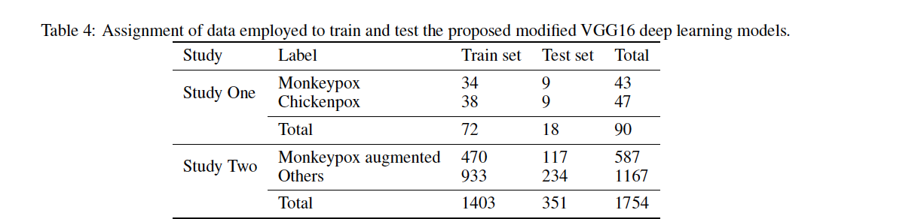

# Improving EfficientNetB0 for Monkeypox Detection
Initial experiments using the first paper in the earlier_experiments folder.

## New Data

Now, we're concetrating on this new data from the revised paper attached.

What the paper expects!

**Chickenpox, also known as varicella.**

**Use the converted_ data for experiments.**

